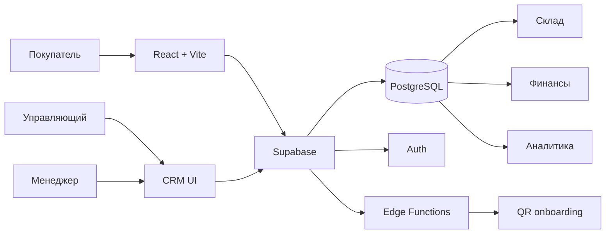

<div align="center">

# ⚡ TEHNO CENTER 2

### Storefront · CRM · Warehouse · Finance · QR Staff Access

[](https://react.dev/)
[](https://www.typescriptlang.org/)
[](https://supabase.com/)
[](https://vercel.com/)

**TEHNO CENTER 2** — единая система магазина бытовой техники: публичный каталог для покупателя и закрытая CRM для управляющего и менеджеров.

`Каталог → заявка → менеджер → продажа → склад → финансы → аналитика`

</div>

---

## 🛍️ Покупательская часть

- Каталог открывается сразу при входе на сайт.
- Mobile-first интерфейс с компактным поиском, горизонтальными категориями и двумя карточками товара в ряд на телефоне.
- Второстепенные страницы — «О нас», контакты и FAQ — вынесены в burger-меню.
- Карточка товара поддерживает фотографии, свайп, полноэкранный просмотр, рассрочку и сворачиваемое длинное описание.
- Покупателю не показывается внутренний остаток склада.
- Заявку можно оформить независимо от текущего остатка: публичный заказ работает как **backorder**, а реальное наличие проверяется сотрудниками уже при подтверждении/выдаче.
- Корзина не ограничивает количество значением `stock`.
- Footer сделан компактным, чтобы не растягивать мобильную страницу.

## 🧑‍💼 QR-доступ менеджеров

Email-приглашения больше не обязательны.

```text
Управляющий
   │
   ├─ вводит ФИО + телефон
   │
   ├─ получает одноразовый QR на 24 часа
   │
   ▼
Менеджер сканирует QR
   │
   ├─ задаёт личный пароль
   │
   └─ Supabase Auth создаёт аккаунт по номеру телефона
            │
            ▼
     CRM менеджера
```

Защита QR-потока:

- в базе хранится только SHA-256 хэш токена;
- QR одноразовый;
- QR имеет срок действия;
- повторный QR на тот же телефон отзывает предыдущий;
- `service_role` никогда не попадает в браузер;
- создание QR разрешено только активному управляющему;
- после активации менеджер входит по **телефону + паролю**.

При удалении менеджера система:

1. делает профиль неактивным;
2. отзывает refresh-токены;
3. удаляет активные Auth-сессии;
4. закрывает связанные QR-доступы;
5. перераспределяет незакрытые заявки, клиентов и заказы.

## 🧾 Офлайн-продажи

Ошибочную офлайн-продажу управляющий может удалить из CRM безопасной серверной операцией.

Перед удалением PostgreSQL проверяет, что:

- это действительно офлайн-продажа;
- по ней ещё не оформлен возврат;
- комиссия менеджеру не была выплачена;
- поставщику ещё не была произведена выплата.

При удалении одной транзакцией откатываются:

- склад / резерв;
- оплаты;
- рассрочка;
- комиссия менеджера;
- долг поставщику;
- финансовые строки товара;
- агрегаты клиента;
- связанная заявка, если она больше нигде не используется.

Операция фиксируется в `audit_logs`.

## 🏗️ Архитектура



### Frontend

- React 19
- TypeScript
- Vite
- React Router
- Zustand
- Lucide Icons
- собственная CSS-система без тяжёлого UI-фреймворка

### Backend

- Supabase PostgreSQL
- Supabase Auth
- Row Level Security
- PostgreSQL RPC / транзакционные функции
- Supabase Edge Functions
- Realtime

### Hosting

- Vercel
- Node.js `24.x`

## 🔐 Серверные функции

| Функция | Назначение |
|---|---|
| `manager-access` | создать/проверить/активировать QR-доступ менеджера |
| `admin-operations` | защищённые административные действия |
| `create_public_order` | создать публичную заявку/backorder |
| `delete_offline_sale` | атомарно отменить ошибочную офлайн-продажу |
| `archive_manager` | отключить менеджера и отозвать его сессии |
| `confirm_order_sale` | провести фактическую продажу |
| `set_order_status` | управлять жизненным циклом заказа |

## 📦 Поставщики и склад

Новый товар создаётся из принятой строки поставки:

1. создаётся поставщик;
2. добавляются позиции поставки с количеством и закупочной ценой;
3. из конкретной позиции создаётся карточка товара;
4. задаются цена продажи и схема комиссии;
5. склад, себестоимость и связь с поставщиком сохраняются транзакционно.

Удаление товара и поставщика остаётся мягким: рабочий интерфейс их скрывает, но история финансов и продаж не уничтожается.

## 🚚 Жизненный цикл заказа

```text
Новый
  ↓
В работе
  ↓
Подтверждён
  ↓
Курьер забрал
  ↓
Курьер в пути
  ↓
Завершён
```

- При подтверждении товар резервируется.
- При передаче курьеру товар списывается со склада.
- Выручка, себестоимость, долг поставщику и комиссия появляются только после фактического завершения продажи.
- Отказ/отмена возвращают выданный товар на склад.

## 🗃️ Новая миграция

Ключевые изменения QR-доступа, backorder-логики и удаления офлайн-продаж находятся в:

```text
supabase/migrations/20260819160000_qr_managers_backorders_offline_sale_recovery.sql
```

Edge Functions:

```text
supabase/functions/manager-access/index.ts
supabase/functions/admin-operations/index.ts
```

## 🚀 Локальный запуск

```bash
git clone https://github.com/jambekbolsun-coder/tehno.git
cd tehno
npm install
cp .env.example .env.local
npm run dev
```

`.env.local` содержит только публичные настройки Supabase. **Service Role Key нельзя добавлять в Vite/browser environment.**

## ✅ Проверка

```bash
npm run check
npm run test:e2e
```

`npm run check` выполняет TypeScript-проверку, unit/component tests и production build.

Для E2E используется Playwright.

Дополнительный транзакционный серверный сценарий находится в:

```text
supabase/tests/supplier_product_finance_flow.sql
```

Он проверяет цепочку «поставка → товар → продажа → склад → долг → комиссия» и завершает тест через rollback.

---

<div align="center">

### TEHNO CENTER 2

**Один каталог. Одна CRM. Один источник данных.**

</div>
